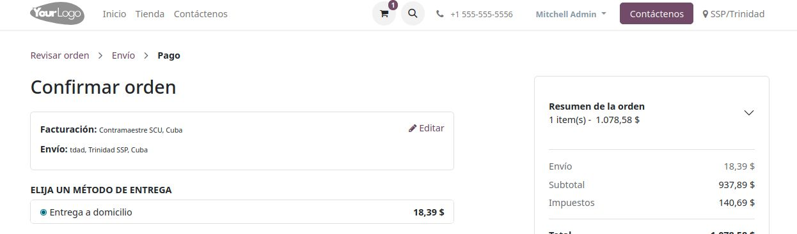

Este modulo permite manejar los productos y metodos de entrega de tu tienda online creanda con odoo17.

Los usuarios al acceder a tu tienda se les mostrará un formuario donde seleccionan su provincia y municipio, hasta que no seleccionen una direccion no podran acceder a los detalles de los productos.
Con el municipio especificado, se les mostrara mensajes de la disponibilidad del producto en su area.
Los productos que no esten disponibles en el area del usuarios, no podran ser añadidos al carrito.

En la configuración de los productos y metodos de entrega, se deben especificar los municipios para los que estan disponibles.
Cuando el usuario va acomprr algun producto, se le mostraran los metodos de envio que estén disponibles en su zona.

Las provincias y municipios (de Cuba),serán añadidos automaticamente a la base de datos al instalar el modulo.
El campo de codigo postal no es requerido y esta oculto en el formulario para las direcciones de envio y facturación.

#Capturas:

